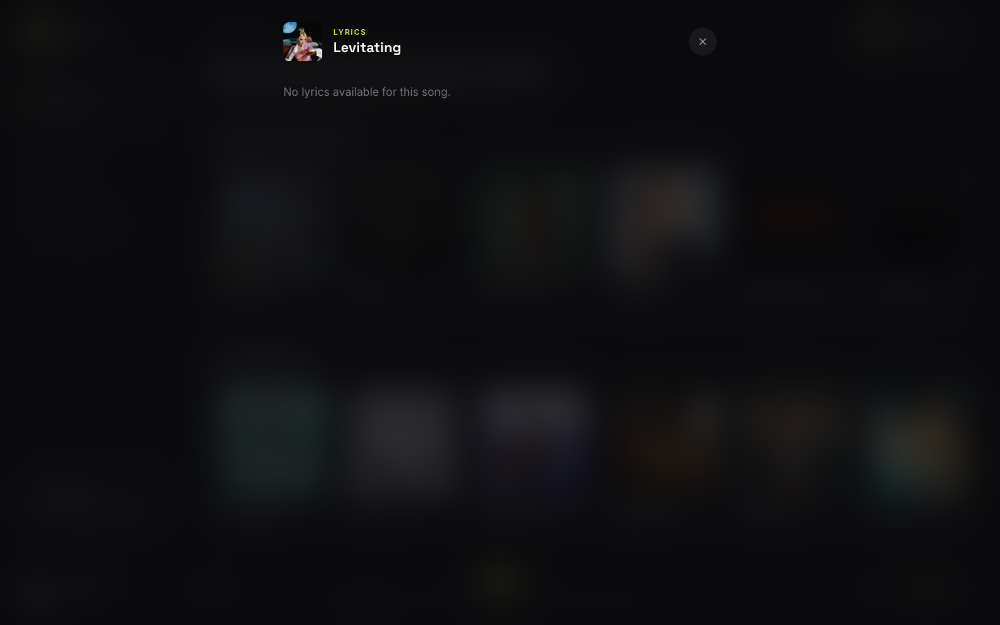

# Hirmify

Hirmify is a modern music streaming web app — installable as an app (PWA) on
desktop and mobile. Stream millions of songs, search artists, read lyrics, and
build your own liked-songs library.

**Live:** https://hirmify.vercel.app/


> 🎬 Higher-quality video: [screenshots/demo.mp4](screenshots/demo.mp4)

## Features

- **Login & Register** — secure account system with token-based auth
- **Song playback** — full player with seek, volume, previous/next
- **Smart autoplay** — when a song ends, the next one is picked from the
  artist's top songs (falls back to your liked songs)
- **Song & artist search** — debounced-as-you-type search with language
  filter chips (English / Hindi / All)
- **Artist pages** — follower count, verified badge, popular songs
- **Liked songs** — like/unlike from anywhere, manage your library
- **Lyrics** — read lyrics for the current track from the player
- **Installable (PWA)** — install from the browser and use it like a native
  app, with lock-screen/hardware media controls (Media Session API)

## Screenshots

### Home

Real trending charts, personalized greeting, and the always-on player.


### Search

Debounced search with language chips and clean, deduplicated results.


### Artist

Blurred-artwork hero, verified badge, and the artist's most popular songs.


### Lyrics

Full-screen lyrics for the current track.



### Liked Songs

Your personal library — play, unlike, or remove songs.


### Login & Register

<p>
  
  
</p>

### Artists search & Mobile

<p>
  
  
</p>

## Tech stack

React 18 · Vite 7 · Tailwind CSS · React Router 6 · vite-plugin-pwa (Workbox)

## Project structure

```
src/
├── config/env.js        API base URLs (env-driven)
├── services/            All API access lives here
│   ├── httpClient.js    fetch wrapper (JSON, bearer auth, error normalizing)
│   ├── musicService.js  Proxy_Server_Song (JioSaavn proxy) client
│   └── userService.js   Hirmify user/auth API client
├── context/
│   ├── AuthContext.jsx  login/register/logout, user session (cookies)
│   └── PlayerContext.jsx playback, queue, liked songs, Media Session
├── hooks/useDebounce.js
├── utils/song.js        API song -> player track mapping, formatters
├── components/
│   ├── layout/          Sidebar (+ mobile bottom nav), TopBar, PlayerBar, AppLayout
│   └── ui/              Logo, SongCard, SongRow, SearchInput, Skeletons, LyricsPanel, ...
└── pages/               Home, SearchSongs, SearchArtists, Artist, LikedSongs, Auth
```

## Getting started

```bash
npm install
npm run dev      # http://localhost:5173
```

The app talks to two backends (see `src/config/env.js`):

| Variable | Default (dev) | Default (prod) |
| --- | --- | --- |
| `VITE_MUSIC_API_URL` | `http://localhost:3000` (local Proxy_Server_Song) | `https://proxy-server-song-v2.vercel.app` |
| `VITE_USER_API_URL` | `https://hirmify-api.vercel.app` | same |

Copy `.env.example` to `.env.local` to override. For local development, run
the proxy first: `cd ../Proxy_Server_Song && npm run start`.

## Build & deploy

```bash
npm run build    # outputs dist/ with service worker + manifest
npm run preview  # test the production build (PWA works here, not in dev)
```

Deployed on Vercel — `vercel.json` rewrites all routes to `index.html` (SPA).

## Install as an app

Open the site in Chrome/Edge (desktop or Android) and click **Install** in the
address bar, or **Add to Home Screen** in Safari on iOS. The app runs
standalone with its own icon and responds to hardware/lock-screen media keys.

## Feedback

If you have any feedback, please reach out to me at reynard.satria@gmail.com
