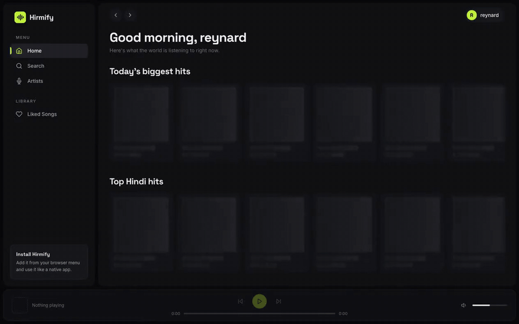
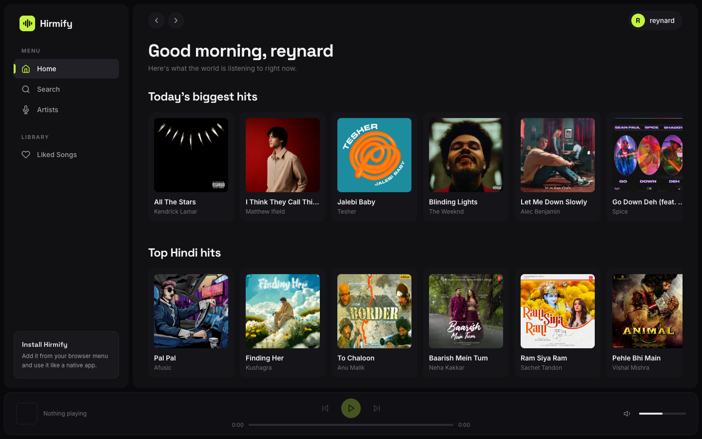
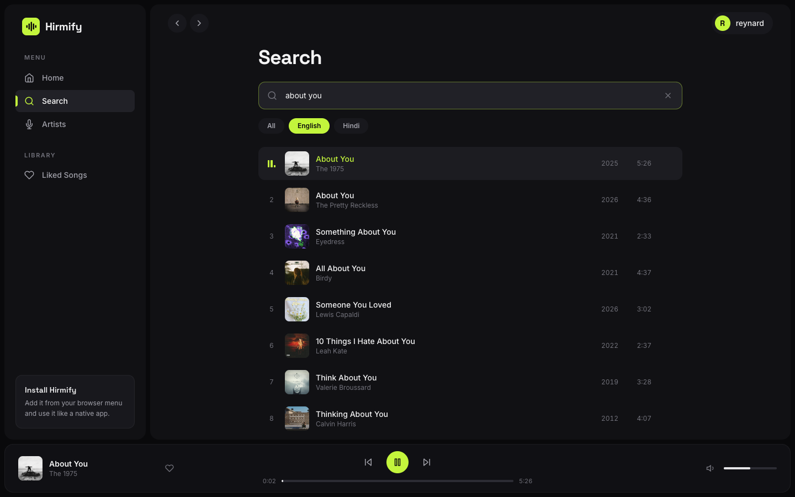
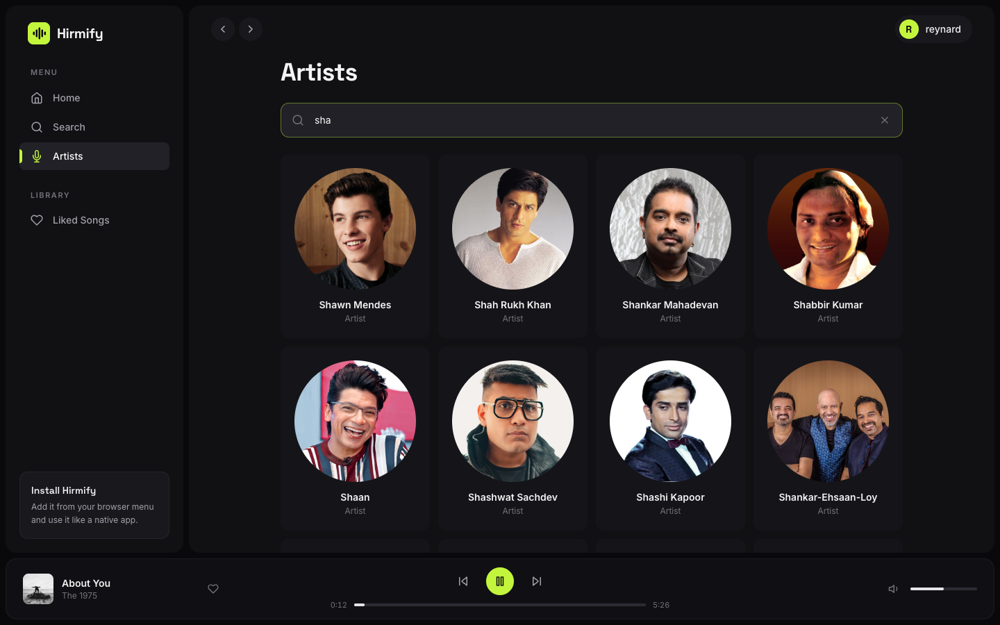
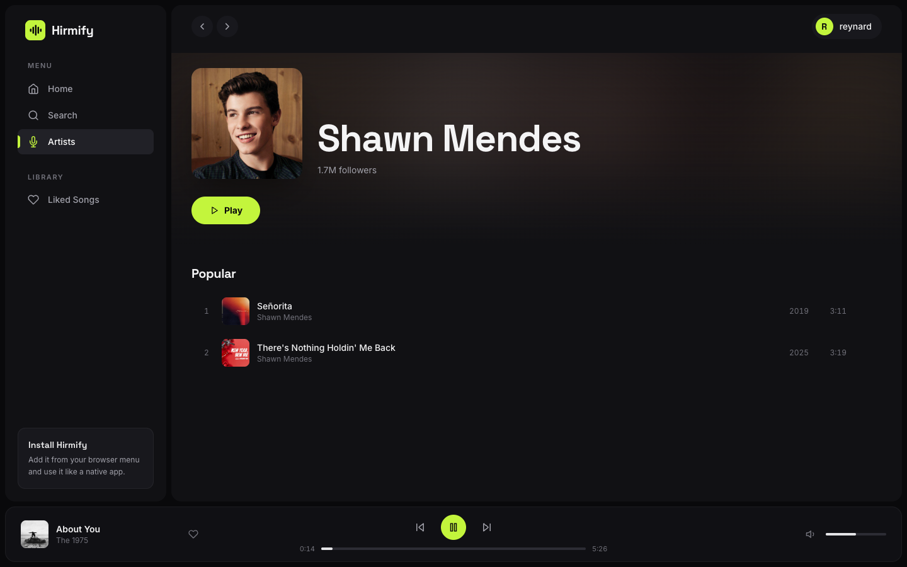
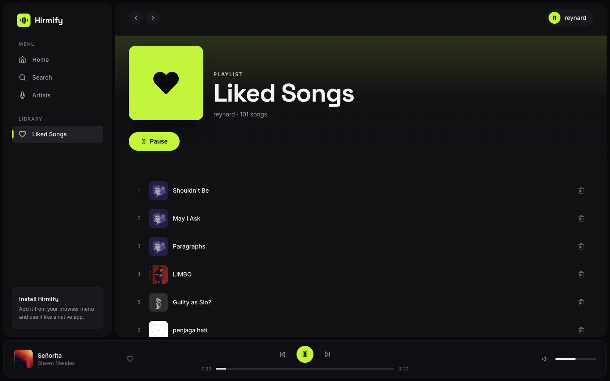
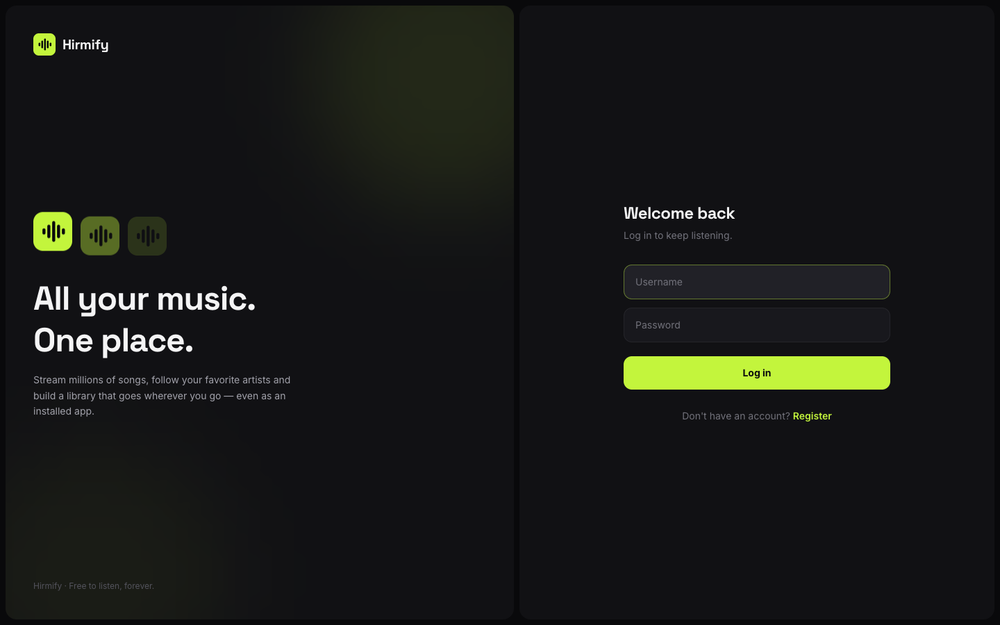
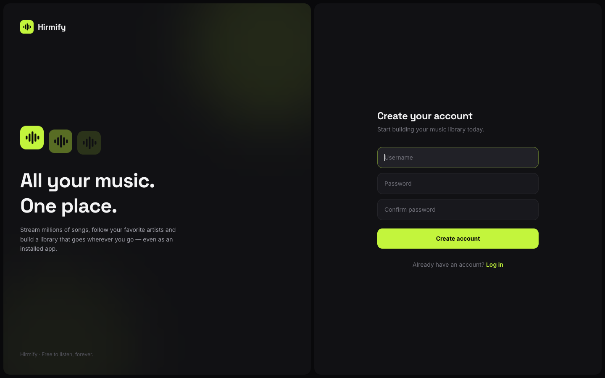
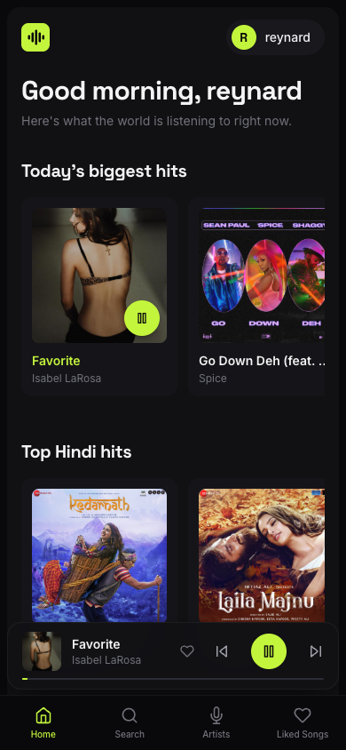

# Hirmify

A music streaming web app I built with React — stream millions of songs,
follow your favorite artists, and build a library that's actually yours.
It installs like a native app too (PWA), so it lives on your home screen
and responds to your lock-screen media controls.

**Try it here → https://hirmify.vercel.app/**



*Prefer a sharper version? Grab the [demo video](screenshots/demo.mp4).*

## What's inside

The usual suspects — login, search, playback — but with the details that
make it feel like a real music app:

- A full player with seek, volume, previous/next, and **smart autoplay**:
  when a song ends, Hirmify quietly picks the next one from the artist's
  top songs (or your liked songs if it runs out of ideas)
- Search that filters by language (All / English / Hindi) and remembers
  your choice
- Artist pages with follower counts and their most popular tracks
- A liked-songs library you can build from anywhere in the app — the heart
  responds instantly, no waiting for the network
- Media Session support — play/pause from your keyboard or lock screen

## A quick tour

This is what you land on — real trending charts, not filler:



Search for anything, pick a song, and it just plays:



Looking for someone? Type a few letters and the artists show up:



Open an artist to see their most popular songs:



And everything you've liked lives in one place:



## Login

Simple username + password, with a clean split-screen layout:



## Register

New here? Creating an account takes a few seconds:



## Mobile

The layout reshapes itself on phones — bottom navigation, floating
mini-player, and it installs to your home screen like a native app:



## Under the hood

React 18, Vite 7, Tailwind CSS, React Router 6, and vite-plugin-pwa for the
installable bits. No state library — two React contexts (auth and player)
cover everything this app needs.

```
src/
├── config/env.js        API base URLs (env-driven)
├── services/            every API call lives here, nowhere else
├── context/             AuthContext + PlayerContext (playback, queue, likes)
├── hooks/               useDebounce
├── utils/               song mapping & formatting helpers
├── components/
│   ├── layout/          Sidebar, TopBar, PlayerBar, mobile nav
│   └── ui/              cards, rows, inputs, skeletons, now playing...
└── pages/               Home, Search, Artists, Artist, Liked, Auth
```

Music data comes from [Proxy_Server_Song_v2](https://github.com/ReynardChristiansen/Proxy_Server_Song_v2)
(a JioSaavn proxy), and accounts live on a separate user API.

## Run it yourself

```bash
npm install
npm run dev        # opens on http://localhost:5173
```

By default, dev mode expects the proxy on `localhost:3000` — or point it at
the deployed one by copying `.env.example` to `.env.local`:

```
VITE_MUSIC_API_URL=https://proxy-server-song-v2.vercel.app
VITE_USER_API_URL=https://hirmify-api.vercel.app
```

For a production build: `npm run build`, then `npm run preview` to try it —
that's also where the PWA install works (it doesn't in dev mode).

## Install it as an app

Visit the site in Chrome or Edge and hit **Install** in the address bar
(or **Add to Home Screen** on iOS Safari). You get a standalone window,
an app icon, and hardware media-key support.

## Feedback

Found a bug or have an idea? Reach me at reynard.satria@gmail.com
